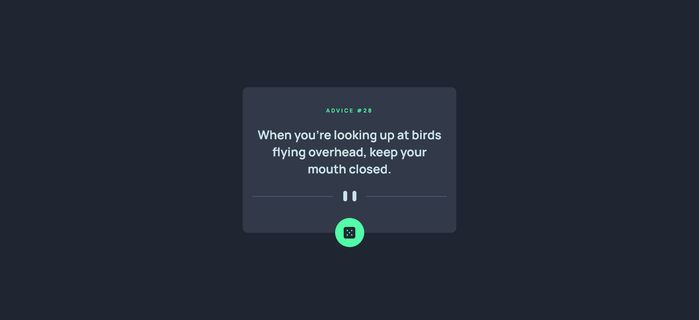

# Frontend Mentor - Advice generator app solution

This is a solution to the [Advice generator app challenge on Frontend Mentor](https://www.frontendmentor.io/challenges/advice-generator-app-QdUG-13db).

## Table of contents

- [Overview](#overview)
  - [The challenge](#the-challenge)
  - [Screenshot](#screenshot)
  - [Links](#links)
- [My process](#my-process)
  - [Built with](#built-with)
  - [What I learned](#what-i-learned)
- [Author](#author)
- [Acknowledgments](#acknowledgments)


## Overview

### The challenge

Users should be able to:

- View the optimal layout for the app depending on their device's screen size
- See hover states for all interactive elements on the page
- Generate a new piece of advice by clicking the dice icon

### Screenshot




### Links

- Solution URL: [solution URL here](https://github.com/uvdevelop26/advice-generator-app)
- Live Site URL: [live site URL here](https://uvdevelop26.github.io/advice-generator-app/)

## My process

### Built with

- Semantic HTML5 markup
- CSS custom properties
- Flexbox
- Mobile-first workflow


### What I learned

fetching data from an API is something I still need to improve, 
in this project I learned the very basics of it

```js
   fetch(adviceApi + '/' + randomId)
        .then((response) => response.json())
        .then((advice) => {
            insertAdvice(advice.slip.id, advice.slip.advice);
        })
```

## Author

- Frontend Mentor - [@uvdevelop26](https://www.frontendmentor.io/profile/uvdevelop26)


